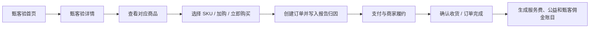
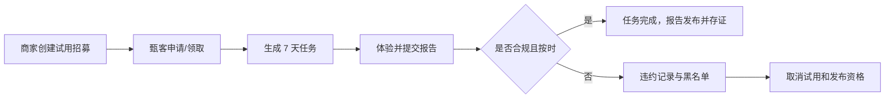
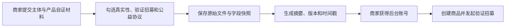
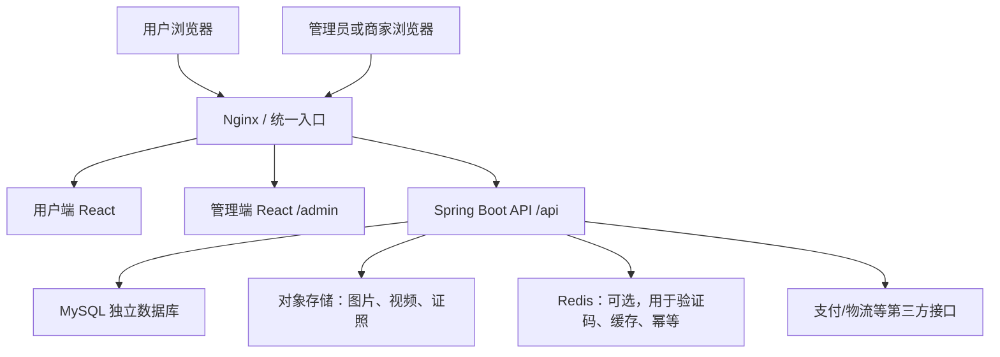

# 㤫者商城：项目理解与完整建设方案

> 文档定位：项目总纲 / 产品与技术共同基线  
> 编写依据：`㤫者商城-改造方案`、`delivery-main` 当前源码与打包演示版本  
> 当前结论日期：2026-07-14  
> 状态：供确认，确认后作为后续需求拆分、数据库设计和开发验收的上位文档

---

## 1. 我对这个项目的总体理解

㤫者商城不是一个“商品先行、评价附属”的普通商城，而是一个以第三方真实验证内容为入口的**可信验证商城**。

它的核心不是多卖几个 SKU，而是建立一条可追踪、可约束、可结算的信任链：

> 用户先看甄客验，再决定买什么；甄客独立验证、如实写出优点和不足；报告促成成交后，甄客获得回报；领取试用却不履约的人失去资格。

一句话产品定位：

> **先看验证，再买货。验证的人独立、负责、有回报。**

因此，这个项目最终应当同时具备四种属性：

1. **内容社区属性**：首页是一条条“甄客验”，而不是普通商品货架。
2. **电商交易属性**：商品、SKU、购物车、订单、支付、发货、收货、退款等基础能力完整存在。
3. **验证任务属性**：商家发起试用招募，用户领取试用，限期提交合规报告，系统处理逾期和违约。
4. **可信记账属性**：报告、商家自证、订单来源、佣金、公益金额都能留痕、追踪和对账。

项目成败不取决于页面是否像商城，而取决于下面三个闭环能否真实成立：

- **内容闭环**：试用 → 真实体验 → 合规甄客验 → 有用反馈。
- **交易闭环**：甄客验 → 商品 → 下单 → 支付 → 履约 → 售后。
- **利益闭环**：成交归因 → 甄客佣金 → 公益记账 → 可追溯、可冲正、可结算。

---

## 2. 产品的核心原则

后续所有产品和技术决策都应服从以下原则。

### 2.1 验证内容优先，商品信息其次

- 首页主内容是甄客验瀑布流。
- 每张内容卡代表一份验证报告，不代表一个商品。
- 商品从报告中被引出，不设置抢占主入口的普通“商品广场”。
- 商品页仍然存在，但主要承担验证、商品信息与购买的闭环。

### 2.2 真实比完美重要

- 报告必须包含真实体验和有效不足。
- 至少上传 1 张实拍图，视频可选。
- 真实体验正文不少于 20 字。
- “无、暂无、没有、都挺好”等内容不能充当不足。
- 报告发布和后续处置必须留痕，不能只改一个前端状态。

### 2.3 甄客既有回报，也有责任

- 注册用户默认具备甄客身份和发布资格。
- 用户可以因购买商品或领取试用获得发布资格。
- 领取试用后 7 天内必须发布合规甄客验。
- 超期未发布或发布内容不合规，将被取消试用资格和甄客发布资格。
- “有用”不是普通点赞，代表报告对决策有实际帮助。

### 2.4 商家自证，平台存证

- 商家提交主体资料、产品资料和产地溯源等自证材料。
- 平台不对材料作“官方真实性背书”，但要保存原始内容、提交时间、版本和摘要。
- “不审核”不能理解成平台不处理违法违规内容；平台仍需具备下架、禁用、投诉和审计能力。

### 2.5 成交必须精确归因

- 从哪一条甄客验进入购买，就记录哪一条报告及其作者。
- 归因数据必须进入订单数据，不能只保存在 URL、浏览器或前端状态里。
- 后端必须验证“报告作者、报告商品、订单商品”三者关系，防止伪造归因。
- 多商品购物车应按订单明细记录归因，避免不同商品或不同甄客被错误合并。

### 2.6 资金记录必须可对账、可冲正

- 商家服务费：符合结算条件的成交金额 × 10%。
- 公益记账：符合结算条件的成交金额 × 5%。
- 甄客佣金：存在有效归因时，符合结算条件的成交金额 × 5%。
- 退款、部分退款、取消订单不能简单删除记录，必须生成冲正或调整记录。

---

## 3. 用户与角色

### 3.1 普通注册用户 / 消费者

主要能力：

- 注册、登录、维护个人资料和地址；
- 浏览甄客验、商品和商家自证材料；
- 对他人的报告标记“有用”或取消；
- 申请/领取试用；
- 发布符合条件的甄客验；
- 加入购物车、下单、支付、查看物流、确认收货、申请退款；
- 查看自己的报告、试用任务、订单、消息和收益。

### 3.2 甄客

甄客不是完全独立的一套账号，而是用户拥有的一种验证资格。

建议在数据模型中拆开两个概念：

- `member_level`：甄客 / 验甄客 / 信甄客，仅作展示；
- `review_eligible`：是否具备领取试用和发布甄客验的资格，用于真实权限判断。

这样可以实现“三级身份保留展示，但首版不自动升级”，也可以在违约后取消发布资格而不破坏账号本身。

### 3.3 商家

主要能力：

- 提交商家主体和自证材料；
- 维护自己的商品、SKU、库存和上下架状态；
- 发起、结束试用招募；
- 查看申请/领取情况和对应报告；
- 查看、发货和处理自己的订单及售后；
- 查看服务费、公益金额和结算明细；
- 不能查看或修改其他商家的数据。

### 3.4 平台管理员 / 运营人员

主要能力：

- 查看平台数据看板；
- 管理用户、甄客资格和黑名单申诉；
- 管理商家状态及其自证材料版本；
- 管理商品、试用、报告和违规处置；
- 查看全平台订单、售后、佣金和公益账本；
- 对关键业务操作留下后台审计日志；
- 手工调整展示身份，但首版不自动升级。

后续可按需要拆出客服、财务、内容运营等细分后台角色，首版可以先使用管理员和商家两级 RBAC。

---

## 4. 三条核心业务流程

### 4.1 信任成交闭环

关键约束：

- 进入商品时携带 `reviewId` 和 `verifierId`。
- 创建订单时由后端根据 `reviewId` 查询真正作者，不信任前端直接提交的作者 ID。
- 归因至少保存在订单明细；单商品订单可同时冗余到订单主表便于查询。
- 只有订单达到结算状态后才生成或解冻佣金。

### 4.2 免费试用冷启动闭环

首版建议采用规则判定，不引入 AI 审核：

- 图片数量不少于 1；
- 正文不少于 20 字；
- 不足必填且不能命中无效占位词；
- 同一用户对同一商品最多保留一份有效甄客验；
- 后台事后认定不实、过度宣传或抄袭时，可以撤下报告并追记违规。

### 4.3 商家入驻与存证闭环

这里的“存证”首版是平台数据库和对象存储中的证据快照，不是区块链，也不代表平台认证材料真实。

---

## 5. 已确认的业务规则

| 规则 | 首版定义 |
| --- | --- |
| 品牌 | 㤫者商城 |
| 验证者称谓 | 甄客 |
| 验证内容称谓 | 甄客验 |
| 底部导航 | 甄客验、我的，共 2 个 Tab |
| 发布资格来源 | 买过该商品，或领取过该商品试用 |
| 报告图片 | 至少 1 张实拍图 |
| 报告视频 | 可选 1 段，具体大小和时长待定 |
| 真实体验 | 必填且不少于 20 字 |
| 不足 | 必填，不能为无效占位内容 |
| 一人一商品 | 同一用户对同一商品最多一份有效甄客验 |
| 有用 | 同一用户对同一报告最多 1 次，可取消，不能给自己点 |
| 试用期限 | 领取后 7 天内提交合规甄客验 |
| 试用违约 | 永久取消试用资格并取消甄客发布资格，后台可解除 |
| 已得验 | 商品存在至少 1 份已发布有效甄客验 |
| 自动升级 | 首版关闭，三级身份仅展示 |
| 商家入驻 | 自证 + 平台存证，不作官方真实性背书 |
| 服务费 | 成交结算金额 × 10% |
| 公益金额 | 成交结算金额 × 5% |
| 甄客佣金 | 有有效报告归因时，成交结算金额 × 5% |
| 存证方式 | 平台自建存证，不上链 |
| 退换货 | 保留基础售后能力，不突出等级差异和“无理由退货”卖点 |

所有金额建议用“分”为单位的整数保存和计算，不能使用浮点数直接进行财务运算。

---

## 6. 当前源码真实完成度

### 6.1 已经具备的资产

用户端 `delivery-frontend` 已经演示：

- 注册登录与个人资料；
- 甄客验瀑布流、报告详情和商品详情；
- “正在寻找甄客”和申请试用；
- 图文/视频报告表单及基础规则校验；
- “有用”交互；
- 商品归因参数、购物车、下单、模拟支付、收货和评价；
- 地址、物流、订单、试用、收益和商家入驻页面；
- 5% 佣金和 5% 公益金额的前端计算演示。

管理端 `delivery-admin-frontend` 已经演示：

- 管理员/商家两类登录；
- 商家数据隔离的前端过滤；
- 数据看板；
- 商品、试用招募、订单、报告、商家管理；
- 发货、退款、报告上下架、商家启禁用；
- 订单归因和分账金额展示。

代码还包含一批工具函数单元测试，可以保留并扩展。

### 6.2 现有实现仍属于前端原型的部分

- 两端商品、订单和商家数据来自各自 Mock，彼此不共享。
- 除登录快照外，大部分状态只存在 React 内存，刷新即恢复。
- 用户密码以明文保存在浏览器本地，只能用于演示。
- 管理端账号密码硬编码在前端包中。
- 图片/视频多为 Base64 或临时 URL，没有正式对象存储。
- 头像上传是 Umi 开发期 Mock 接口，不是 Spring Boot 接口。
- 支付、发货、退款和佣金结算均为前端模拟。
- 逾期只有展示，没有自动执行黑名单与资格取消。
- 仍保留自动升级提示和 7/15/30 天等级退换逻辑，与首版方案冲突。

### 6.3 后端现状

`delivery-backend` 已完成目录和命名修正，但现在仍只有：

- Spring Boot 启动类；
- Web 和 MySQL 驱动依赖；
- 基础应用名称配置；
- 空的启动测试。

尚无数据库连接、建表迁移、实体、数据访问层、服务层、控制器、认证、文件上传和任何业务接口。

因此，准确的项目状态是：

> **前端高保真 MVP 已存在，后端与持久化需要正式建设。**

---

## 7. 目标系统架构

首版建议采用**模块化单体**，不采用微服务。原因是当前团队规模和业务量尚不需要分布式复杂度，但代码内部必须按领域拆分。

推荐部署入口：

- `/`：用户端；
- `/admin/`：管理端；
- `/api/`：后端接口；
- 静态资源和文件使用对象存储地址或受控下载接口。

没有域名时可以先用 IP + 端口联调，但正式支付、HTTPS、安全 Cookie、第三方回调通常需要稳定域名和证书，因此“只用 IP”适合作为开发和内部验收阶段，不应视为最终生产形态。

---

## 8. 后端模块划分

建议在同一个 Spring Boot 工程中按领域建立以下模块：

| 模块 | 负责内容 |
| --- | --- |
| `auth` | 登录、注册、令牌、密码、会话、验证码 |
| `user` | 用户资料、展示等级、甄客资格、地址 |
| `merchant` | 商家账号、主体资料、自证材料、状态 |
| `catalog` | 商品、SKU、分类、媒体、库存、上下架 |
| `trial` | 试用招募、申请/领取、期限、履约、逾期 |
| `review` | 甄客验、媒体、合规校验、有用、存证、违规 |
| `cart` | 服务端购物车和归因上下文 |
| `order` | 下单、拆单、状态机、订单明细、地址快照 |
| `payment` | 支付单、回调幂等、退款记录 |
| `fulfillment` | 发货、物流公司、运单和物流轨迹 |
| `ledger` | 服务费、甄客佣金、公益账本、冲正和结算 |
| `notification` | 站内消息及后续短信/微信通知扩展 |
| `file` | 上传凭证、文件元数据、访问控制 |
| `admin` | 平台后台查询、审核处置、人工解除、看板 |
| `audit` | 后台关键操作、状态变更和证据操作日志 |

模块之间通过应用服务调用，禁止控制器直接跨表拼接全部业务。

---

## 9. 核心数据模型

下面不是最终 SQL，但应作为数据库设计的最小范围。

### 9.1 账号与权限

- `user_account`：账号、手机号/用户名、密码摘要、状态、展示等级、甄客资格。
- `user_address`：收货人、手机号、地区、详细地址、默认标记。
- `admin_account`：后台账号、角色、状态。
- `merchant_account`：商家登录账号与商家主体关联。
- `role` / `permission`：若首版权限简单，可先使用枚举，保留未来细分能力。

### 9.2 商家和存证

- `merchant`：名称、联系人、电话、地址、状态、协议勾选时间。
- `merchant_evidence`：材料类型、原始文件、字段快照、版本、摘要、提交时间。
- `product_evidence`：产品来源、产地、溯源码、自证声明、文件和版本。

证据记录不应被覆盖更新；修改材料时新增版本，旧版本保留。

### 9.3 商品

- `product`：商家、标题、分类、介绍、状态、是否已得验。
- `product_sku`：规格、价格、成本、库存、状态。
- `product_media`：主图、轮播图、视频、排序。
- `inventory_log`：库存增加、扣减、释放及对应业务单号。

### 9.4 试用

- `trial_recruitment`：商品、商家、目标人数、开始/截止时间、状态。
- `trial_claim`：招募、用户、领取时间、提交期限、状态、对应报告。
- `blacklist_record`：用户、原因、关联任务、开始时间、解除时间、操作人。

建议状态：

- 招募：`draft / recruiting / full / ended / canceled`；
- 领取：`claimed / pending_report / completed / overdue / violated / canceled`；
- 黑名单：`active / revoked`。

### 9.5 甄客验

- `review`：商品、作者、资格来源、正文、不足、适合人群、推荐、状态。
- `review_media`：图片/视频文件、类型、排序。
- `review_useful`：报告、用户、创建时间；数据库唯一约束 `(review_id, user_id)`。
- `review_evidence`：发布版本、内容快照、媒体清单、摘要、存证时间。
- `review_violation`：违规类型、说明、处理人、处理结果。

建议报告状态：`draft / published / hidden / violating / revoked`。

### 9.6 订单与履约

- `trade_order`：用户支付聚合单、总金额、支付状态。
- `merchant_order`：按商家拆分的履约订单、状态、地址快照、金额。
- `order_item`：SKU、数量、成交单价、退款金额、来源报告、来源甄客。
- `order_status_log`：每次订单状态变更。
- `payment_record`：支付渠道、支付流水、金额、回调状态、幂等键。
- `refund_record`：退款申请、原因、金额、渠道状态。
- `logistics_record`：物流公司、运单号、轨迹和签收状态。

将归因字段放在 `order_item` 的原因是：一个购物车可能同时包含不同商品和不同甄客来源。若首版每单只允许一个商品，可以在订单主表冗余 `from_review_id` 和 `from_verifier_id`，但不应失去明细级扩展能力。

### 9.7 财务账本

- `settlement_ledger`：统一记录服务费、甄客佣金、公益金额及冲正。
- `verifier_earning`：面向甄客展示的收益明细和状态。
- `charity_record`：公益金额、订单来源、状态、后续捐赠批次。
- `settlement_batch`：未来真实结算批次，可在首版只保留结构。

建议账目状态：`pending / frozen / available / settled / reversed`。

账本应采用“新增记录修正历史”的方式，不直接改掉原金额。

---

## 10. API 规划

统一前缀建议使用 `/api/v1`，响应格式、错误码、分页和鉴权规则全局统一。

### 10.1 用户端 API

- `/auth/register`、`/auth/login`、`/auth/logout`、`/auth/refresh`
- `/users/me`、`/users/me/addresses`
- `/reviews/feed`、`/reviews/{id}`、`/reviews/{id}/useful`
- `/products/{id}`、`/products/{id}/reviews`
- `/trial-recruitments`、`/trial-recruitments/{id}/claim`
- `/trial-claims/mine`
- `/reviews`：创建甄客验，后端重复执行合规校验
- `/cart/items`
- `/orders`、`/orders/{id}`、`/orders/{id}/cancel`
- `/orders/{id}/pay`、`/orders/{id}/confirm-receipt`
- `/orders/{id}/refunds`
- `/earnings/mine`
- `/notifications/mine`
- `/files/upload-credentials` 或 `/files/upload`

### 10.2 商家 API

- `/merchant/profile`、`/merchant/evidence`
- `/merchant/products`
- `/merchant/trial-recruitments`
- `/merchant/orders`、`/merchant/orders/{id}/ship`
- `/merchant/refunds/{id}/process`
- `/merchant/reviews`
- `/merchant/ledger`

### 10.3 平台管理 API

- `/admin/dashboard`
- `/admin/users`、`/admin/users/{id}/review-eligibility`
- `/admin/blacklist-records`、`/admin/blacklist-records/{id}/revoke`
- `/admin/merchants`、`/admin/merchants/{id}/status`
- `/admin/products`、`/admin/reviews`、`/admin/trials`
- `/admin/orders`、`/admin/refunds`
- `/admin/ledger`、`/admin/charity-records`
- `/admin/audit-logs`

前端传来的商家 ID、甄客 ID、订单金额、佣金金额都不能直接信任，必须由后端根据登录身份和数据库数据计算。

---

## 11. 关键状态机和一致性要求

### 11.1 订单状态

建议主流程：

`pending_payment → paid → pending_shipment → shipped → completed`

分支状态：

- 待支付可取消；
- 已支付可申请退款；
- 发货后进入售后流程；
- 完成后收益从冻结转为可结算；
- 全额退款后对应账本冲正。

所有状态变化必须在后端检查当前状态，不能由前端自由设置下一个状态。

### 11.2 试用逾期

首版可以同时使用两种机制：

1. 定时任务扫描超过期限、仍未完成的 `trial_claim`；
2. 用户申请试用或发布报告时再次惰性检查，避免定时任务遗漏。

处罚动作应在同一事务内完成：任务置为违约、创建黑名单记录、关闭试用资格和甄客发布资格。

### 11.3 支付回调和重复操作

- 支付回调必须幂等，同一渠道流水只能处理一次。
- 确认收货、生成佣金、点击有用、领取试用都要有数据库唯一约束或幂等键。
- 库存扣减、订单创建和支付状态更新需要事务保护。

---

## 12. 安全和合规底线

- 密码只保存强哈希摘要，禁止明文存储或返回前端。
- 用户端、商家端和管理端权限必须由后端校验，前端隐藏菜单不等于权限控制。
- 管理员关键操作写审计日志。
- 上传文件检查类型、大小、扩展名和访问权限，文件名由服务端生成。
- 身份证、营业执照、手机号和地址等敏感数据按最小权限展示。
- API 使用统一鉴权；生产环境使用 HTTPS。
- 防止越权读取其他用户订单、其他商家商品和证据文件。
- “商家自证、平台不审核”需要在协议和页面文案中准确表达，避免形成平台官方认证的误解。
- 公益宣传、佣金结算、支付和退款在正式上线前需要业务方做法律、税务与支付渠道合规确认。

---

## 13. 前端改造策略

不推倒现有 UI，但要从“单页面 Mock”升级为“可维护的真实应用”。

### 13.1 用户端建议拆分

- `features/auth`
- `features/review-feed`
- `features/reviews`
- `features/products`
- `features/trials`
- `features/cart`
- `features/orders`
- `features/profile`
- `features/merchant-application`
- `services/api`
- `stores` 或统一服务端状态管理层

### 13.2 管理端建议拆分

- `pages/dashboard`
- `pages/products`
- `pages/trials`
- `pages/orders`
- `pages/reviews`
- `pages/merchants`
- `pages/users-blacklist`
- `pages/ledger-charity`
- `services/api`
- `access`

### 13.3 前端迁移原则

- 先保留现有 Mock 作为视觉基准和测试样例。
- 建立 API 客户端和 DTO 后，按模块逐步替换 Mock。
- 页面不直接计算财务结果；前端只展示后端返回的账目。
- 页面不自行决定权限或状态流转。
- 关闭自动升级提示和等级退换天数差异。
- 将结构测试逐步升级为组件测试和关键流程端到端测试。

---

## 14. 实施阶段

### 阶段 0：需求冻结与工程基线

- 确认本文第 17 节的开放问题；
- 建立正式 Git 仓库、分支策略和环境变量模板；
- 修正 Windows 本地启动脚本；
- 两个前端拆出 API 层，后端接入数据库迁移工具；
- 确认开发、测试、生产三套配置。

验收：三端可一键启动，空数据库可自动完成建表，敏感配置不进入仓库。

### 阶段 1：账号、权限、文件和基础资料

- 用户、管理员、商家登录；
- 个人资料、地址；
- 商家主体和自证材料；
- 图片、视频和证照上传；
- 后端 RBAC 与审计基础。

验收：不再使用前端明文账号和 Umi Mock 上传。

### 阶段 2：商品与商家后台

- 商品、SKU、库存、分类、媒体；
- 商品上下架；
- 商家只能管理自己的资源；
- 用户端读取真实商品数据和自证材料。

验收：管理端修改后，用户端刷新能看到一致数据。

### 阶段 3：试用、甄客验与黑名单

- 招募、领取、7 天任务；
- 合规发布、媒体、存证、有用；
- 逾期处理、资格取消、后台解除；
- 关闭自动升级，仅保留展示等级。

验收：免费试用冷启动闭环真实写入数据库，刷新和跨端均保持一致。

### 阶段 4：交易、履约与售后

- 服务端购物车；
- 创建订单、拆单、地址快照、库存；
- 支付适配层，开发环境可用模拟支付；
- 发货、物流、收货、取消和退款；
- 订单状态日志和幂等。

验收：用户端下单后，商家后台能立即看到并完成履约。

### 阶段 5：归因、佣金和公益账本

- 明细级报告归因；
- 完成订单生成 10% 服务费、5% 公益、5% 甄客佣金记录；
- 无归因订单规则；
- 部分退款和全额退款冲正；
- 用户收益、商家账单和管理端公益看板。

验收：任一账目都能反查到订单明细、报告、甄客和状态变更。

### 阶段 6：质量、部署与上线准备

- 单元、集成、接口和端到端测试；
- 初始化数据和演示账号；
- Docker Compose 部署；
- 数据库备份恢复演练；
- 日志、健康检查、错误告警；
- 安全、权限、文件上传和并发测试。

验收：从空服务器到可用系统有完整部署文档，关键流程可重复验收。

---

## 15. 测试与验收重点

最低必须覆盖以下场景：

1. 同一用户不能重复领取同一招募或超额领取。
2. 黑名单用户不能领取试用或发布甄客验。
3. 报告缺图、正文不足 20 字或不足无效时，前后端都拒绝。
4. 同一用户不能给自己的报告点有用，也不能重复计数。
5. 商家不能访问其他商家的商品、订单、报告和账目。
6. 订单归因不能被前端伪造到无关甄客。
7. 一个购物车中不同报告来源的商品能够正确分别归因。
8. 重复支付回调不会重复更新订单或重复生成账目。
9. 确认收货只生成一次佣金和公益记录。
10. 退款后账目正确冻结或冲正。
11. 刷新页面、重新登录和跨端查看时数据一致。
12. 数据库备份可以恢复到可用状态。

---

## 16. 首版明确不做或只做预留的内容

- 甄客 / 验甄客 / 信甄客自动升级；
- 区块链上链；
- 数字人民币智能合约分账；
- 复杂推荐算法；
- 关注关系和完整社交系统；
- AI 自动判断报告真假；
- 大规模微服务和消息队列体系；
- 自动向公益机构真实划款，首版先形成可核对账本；
- 甄客自动提现，首版先记录收益和后台结算状态。

这些能力可以预留数据结构，但不能拖慢首版可信闭环。

---

## 17. 开工前需要业务方最终确认的问题

以下问题不影响我们理解项目，但会影响数据库和结算实现，建议在对应阶段开始前确认。

### 17.1 无甄客归因订单的 5% 如何处理

方案只明确“没有归因时不发甄客佣金”，但没有明确这 5% 最终归商家、平台还是公益。

建议首版：仍收 10% 服务费，其中 5%公益，另外 5%进入“未归因服务费待处理”账目，不直接认定平台收入，待业务确认。

### 17.2 佣金何时可以结算

建议：确认收货后先冻结，超过售后观察期再变为可结算；发生退款则按实际退款比例冲正。

### 17.3 试用是先到先得还是商家筛选

文档同时出现“申请”和“先到先得”。

建议首版采用先到先得，领取即占名额；二期再增加申请审核模式。

### 17.4 试用品如何发货

需要确定试用领取是否生成 0 元试用订单、是否填写地址、是否有物流。

建议生成独立的 0 元试用履约单，以便商家发货、用户查物流和平台判断任务开始时间。

### 17.5 七天从何时开始计算

文档写“领取后 7 天”，但用户未收到货时无法体验。

建议改为“试用订单签收后 7 天”；若业务坚持领取后计算，应明确物流延迟的申诉机制。

### 17.6 商家入驻门槛的实际含义

文档一处写“必须接受公益”，另一处写“协议勾选即可、不做强制校验”。

建议统一为：提交入驻时必须勾选协议，系统不额外验证外部捐赠行为；公益金额由平台订单账本自动记录。

### 17.7 真实支付范围

需要确定首版接微信、支付宝、两者都接，还是先使用测试支付。真实支付还需要商户资质、回调地址、域名和证书。

### 17.8 文件存储

需要在服务器本地存储、独立对象存储或云对象存储之间选择。正式环境建议对象存储，避免容器重建和服务器迁移导致证据文件丢失。

### 17.9 视频限制

需要确定格式、大小、时长、是否转码和是否生成封面。首版可先限制 MP4、单文件和较小体积，避免立即建设视频转码平台。

### 17.10 公益与甄客佣金的财税合规

需要确认佣金是否需要实名、合同、发票或代扣税，公益金额由哪个主体归集和对外披露。这些结论会影响账户字段、结算流程和用户协议。

---

## 18. 建议的第一批实际开发任务

在本文确认后，第一批不要直接开始堆页面，建议按以下顺序：

1. 整理三端工程启动方式，确保 Windows 本地可稳定运行。
2. 为前后端建立环境变量模板和统一 API 地址。
3. 设计并评审首版数据库 ER 图和状态枚举。
4. 建立数据库迁移、统一响应、异常处理、鉴权和审计骨架。
5. 先完成真实登录、用户、商家、商品和文件上传。
6. 用真实 API 替换用户端和管理端对应 Mock。
7. 再进入试用、甄客验、交易和账本闭环。

第一批里最重要的交付物不是更多 UI，而是：

- 一套可持续演进的数据库；
- 一套真实安全的账号与权限；
- 一套两端共享的 API；
- 一套可保存图片、视频和证据的文件系统；
- 一条“后台改数据，用户端立即看到”的真实链路。

---

## 19. 最终目标定义

这个项目完成后，不应再是“两套各自演示的前端页面”，而应是一个真实共享数据、可以持续运营的系统：

> 商家能够提交自证、创建商品并发起试用；甄客能够领取、履约并发布真实报告；消费者能够从具体报告进入商品并完成交易；平台能够准确知道成交由谁的哪条报告促成，并形成可追溯的佣金与公益账本；管理员能够处理逾期、违规、售后和申诉；所有关键数据刷新不丢、跨端一致、权限可靠、操作有据可查。

这就是我理解的“把现有前端 MVP 做成一个完整项目”。
